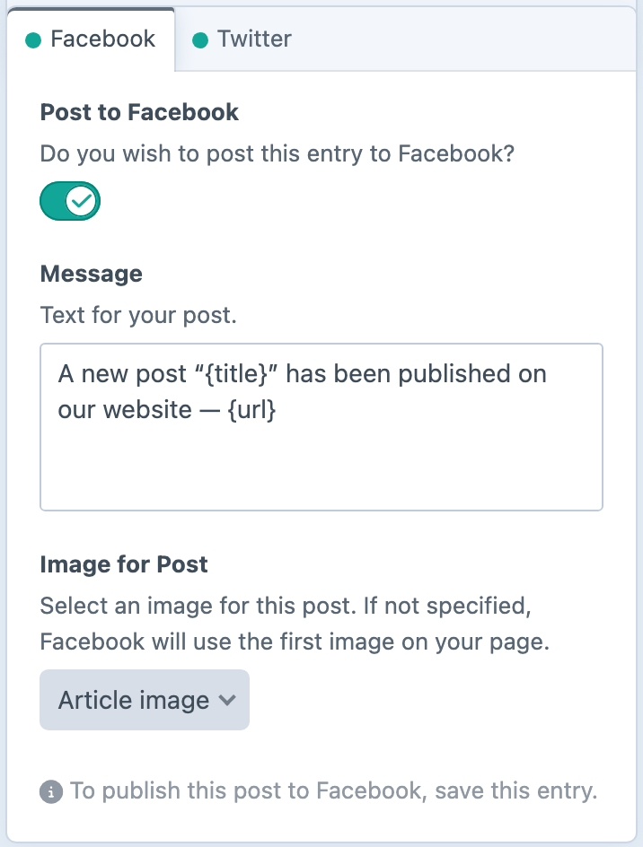
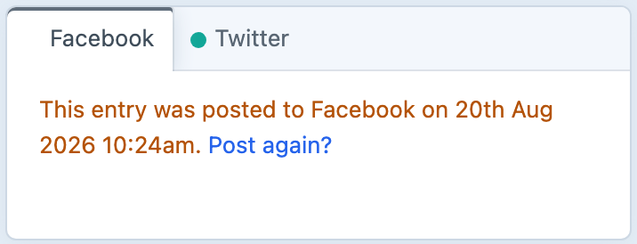
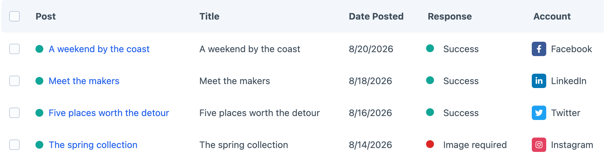
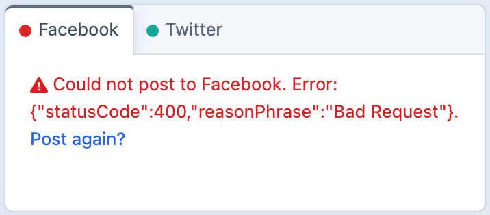

<!-- feature-intro -->
Post entries to supported social channels as part of the publishing workflow. Choose the networks and accounts for each entry, use sensible defaults and post again on demand when needed.
<!-- feature-intro-end -->

<!-- feature-section media-size="small" -->
## Control your social posts

Enable social publishing only for the content types that need it. Each entry gets a publishing panel with an account-by-account status; start from project-defined Twig defaults, adjust the message, choose where it should go and opt in or out for that particular entry.

<!-- feature-section-end -->

<!-- feature-section media-size="small" -->
## Post again on demand

Once an entry has posted successfully, ordinary saves will not send it again. Trigger another post deliberately when the content needs a second outing, with the earlier status still available for reference.

<!-- feature-section-end -->

<!-- feature-section media-size="large" -->
## Keep an eye on every post

Social Poster keeps a record of what was sent, when it went out and which account handled it. Successful posts and provider errors sit together in a familiar Craft element index, so you can spot a problem without checking every social network separately.

<!-- feature-section-end -->

<!-- feature-section media-size="small" -->
## Error indicators

Open a failed post to inspect the provider response, correct the problem and send it again. Provider events allow project-specific destinations or behaviour to join the same workflow.

<!-- feature-section-end -->
